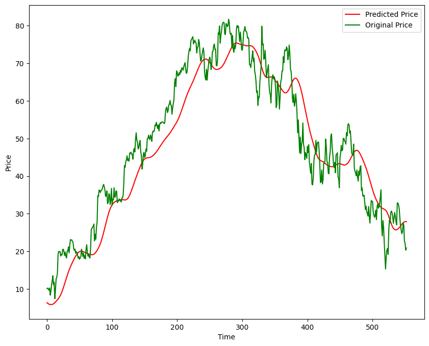

# Stock Price Prediction Model

This project focuses on building a machine learning model to predict future stock prices using historical data. The model leverages algorithms like **Linear Regression**, **Random Forest**, and **LSTM** (*Long Short-Term Memory*) to provide predictions based on features like Open, High, Low, Close prices, and Volume.

## Table of Contents

- [Overview](#overview)
- [Data Description](#data-description)
- [Model Architecture](#model-architecture)
- [Usage](#usage)
- [Results](#results)
- [Contributing](#contributing)
- [License](#license)

## Overview

Stock price prediction is a challenging task due to the volatile nature of the market. This project utilizes a combination of traditional machine learning models and deep learning models to improve the accuracy of predictions. It also provides visualizations to better understand the model's performance.

## Data Description

The dataset used contains historical stock prices and includes the following features:

- **Date**: The trading date.
- **Open**: The price of the stock at the beginning of the trading day.
- **High**: The highest price the stock reached during the trading day.
- **Low**: The lowest price the stock reached during the trading day.
- **Close**: The price of the stock at the end of the trading day.
- **Volume**: The number of shares traded on that particular day.

You can get the historical data from sources like **Yahoo Finance** or **Alpha Vantage**.

## Model Architecture

The model is designed using a Sequential architecture with four LSTM layers and Dropout layers to prevent overfitting. Below is the detailed architecture:

1. **LSTM Layer 1**:
   - Units: 50
   - Activation: ReLU (*Rectified Linear Unit*)
   - Return Sequences: True (*This allows the output to be used as input for the next LSTM layer*)
   - Input Shape: `(x.shape[1], 1)` (Time steps and features)
   
   **Dropout Layer 1**:
   - Dropout Rate: 20% (*To prevent overfitting by randomly setting input units to 0 during training*)

2. **LSTM Layer 2**:
   - Units: 60
   - Activation: ReLU
   - Return Sequences: True

   **Dropout Layer 2**:
   - Dropout Rate: 30%

3. **LSTM Layer 3**:
   - Units: 80
   - Activation: ReLU
   - Return Sequences: True

   **Dropout Layer 3**:
   - Dropout Rate: 40%

4. **LSTM Layer 4**:
   - Units: 120
   - Activation: ReLU
   - Return Sequences: False (*Last LSTM layer doesn’t return sequences, outputting to the Dense layer*)

   **Dropout Layer 4**:
   - Dropout Rate: 50%

5. **Dense Layer**:
   - Units: 1 (*Single unit to output the predicted stock price*)


## Usage

### 1. **Data Preparation**

Before using the model, you need to download and format the stock market data. You can get the historical stock data from sources like **Yahoo Finance** or **Alpha Vantage** and save it as a CSV file. Ensure the data has columns such as *Date, Open, High, Low, Close, Volume*.

### 2. **Training the Model**

To train the LSTM model using your dataset, use the following steps:

1. Place your dataset (CSV file) in the `data/` directory or specify the path in the command.
2. Run the training script:
   ```bash
   python train.py --data data/stock_data.csv

## Results

After training the model and making predictions, the results can be visualized to see the model's performance compared to actual stock prices.

### Sample Result

Below is a sample visualization of the predicted stock prices compared to actual prices:



The chart shows the predicted values in comparison to the actual historical data, indicating the model's accuracy in forecasting future stock prices.

### Evaluation Metrics

- **Mean Squared Error (MSE)**: Measures the average squared difference between the predicted and actual prices.
- **Root Mean Squared Error (RMSE)**: Square root of MSE, providing error in the same unit as the stock prices.
- **R-squared (R²)**: A measure of how well the model's predictions match the actual data.

You can customize the image by placing your result visualization (e.g., `prediction_results.png`) in the same directory and updating the path if needed.


## Contributing

If you'd like to contribute to this project, follow the steps below:

1. **Fork the repository**:
   - Click on the "Fork" button at the top right of the repository page.

2. **Create a new branch for your feature**:
   ```bash
   git checkout -b feature-branch
   ```
3. **Commit your changes:**
   ```bash
   git commit -m 'Add new feature'
   ```
   

## License

This project is licensed under the MIT License.
